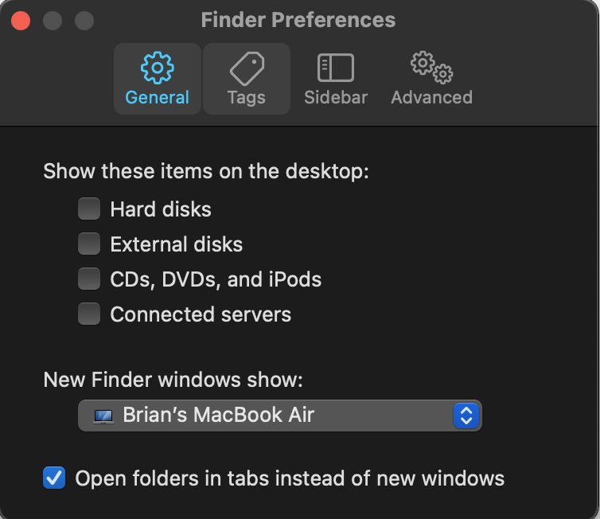
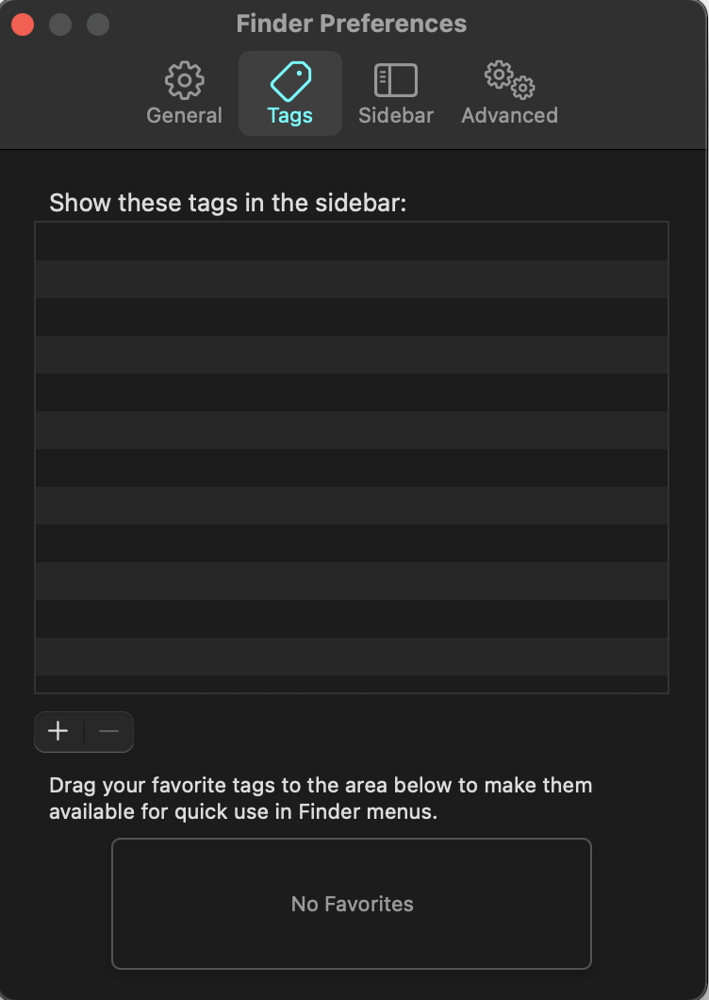
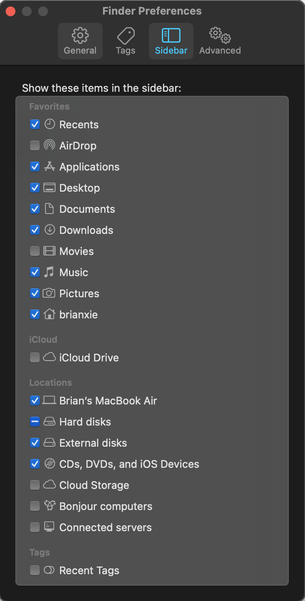
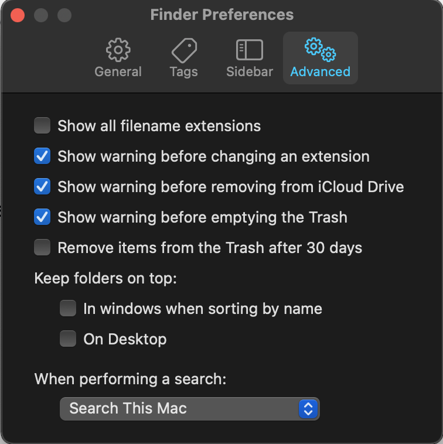
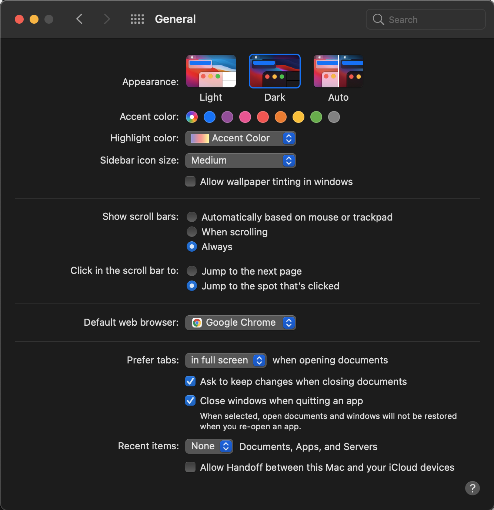
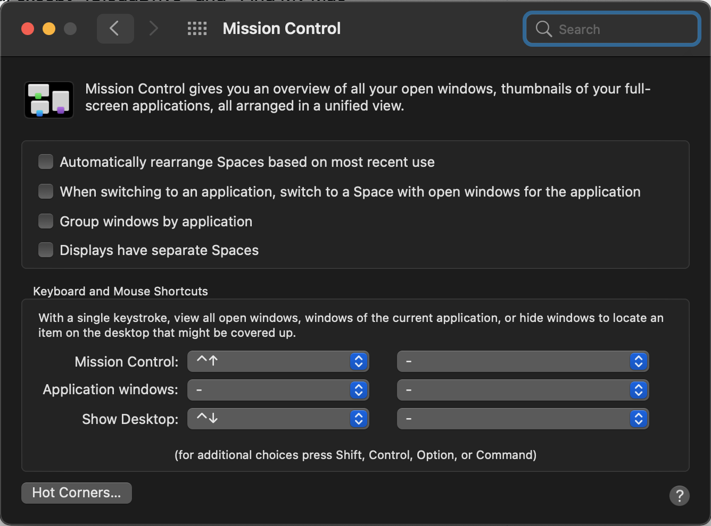

# Dotfiles / Configurations for MacOS 11.1 (Big Sur)

Follow the below instructions to configure your working environment

### System Configurations

1. Uninstall all relevant programs by going to `Launchpad > Applications > drag to trash`. Note that most built-in applications apparently cannot be uninstalled. The only applications which I was able to install include: GarageBand, Keynote, Numbers, Pages. The last three are the equivalent of MS PPT, Excel, and Word.

2. Install Google Chrome + Extensions
    - Vimium (un-exclude gmail)
    - Rearrange Tabs (go to chrome://extensions/shortcuts to configure if necessary)
    - Nordpass
    - AdBlock Pro
    - BlockSite
    - JSON Viewer
    - Remove shortcuts from new tab page (bottom right corner > Customize)
    - Update settings as appropriate
    - Set default page zoom to 110%

3. Install Spotify
    - If necessary, upload and download all local file music into individual folders under "Music", and configure Local Files settings to search the "Music" folder. Note that you may need to change the filenames of some of the songs (apostrophes are converted to underscores)

4. Install NordPass (desktop app)

5. Finder (`Finder > Preferences` in menu bar)

   

6. System Preferences
    - Apple ID: disable any apps using iCloud, except "iCloudDrive" and "Find My Mac"
    - General

        

    - Desktop & Screen Saver
        - Change desktop background (download from Drive)
        - Disable screensaver (start after: Never)
    - Dock & Menu Bar, Mission Control
         
    - Mission Control
    - Siri
    - Language & Region
    - Notifications
    - Bluetooth / Sound
    - Keyboard
    - Trackpad
    - Mouse
    - Display
    - Battery

7. TODO: Install 3rd party programs:
    - Smooze (Mouse)
    - BetterSnapTool
    - Bartender4
    - Alt-Tab
    - Karabiner Elements
    - Alfred 4

8. Miscellaneous manual tasks:
    - Go to Stocks, and configure watchlist appropriately
    - TODO: Printers & Scanners
    - TODO: Speed up animations on MacOS
