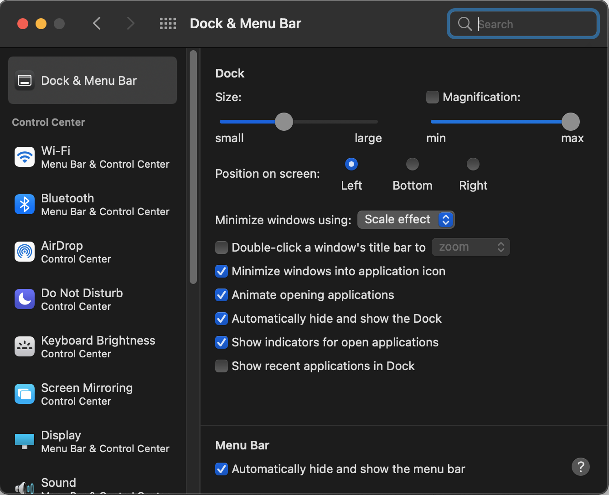
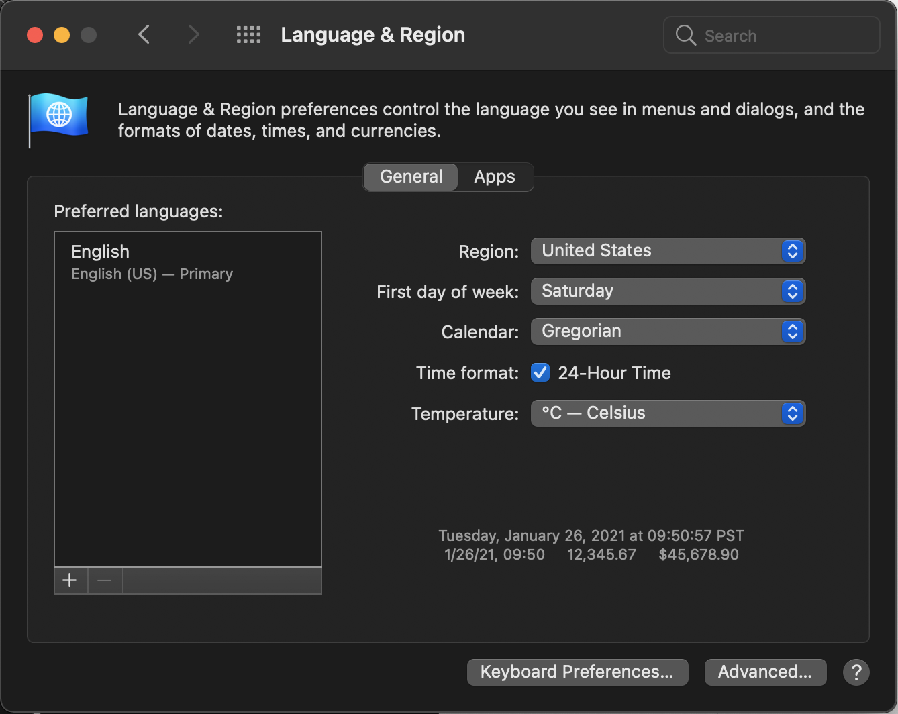
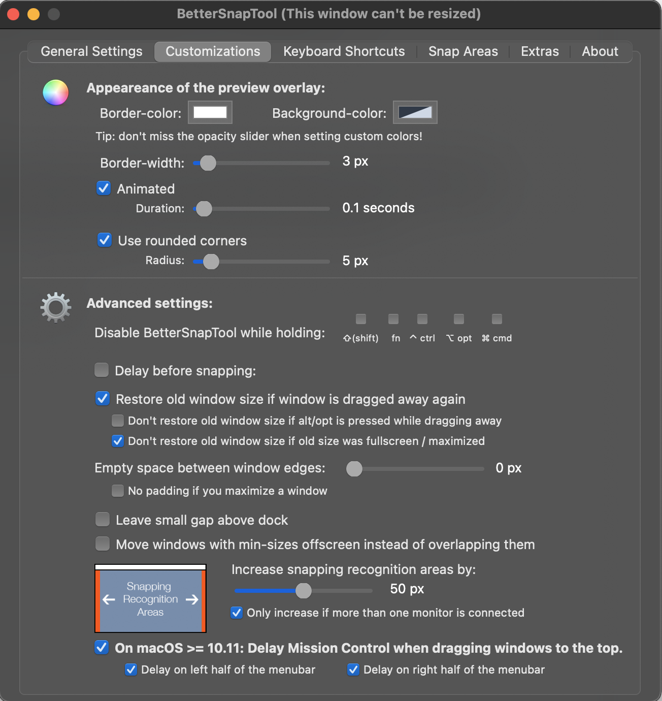
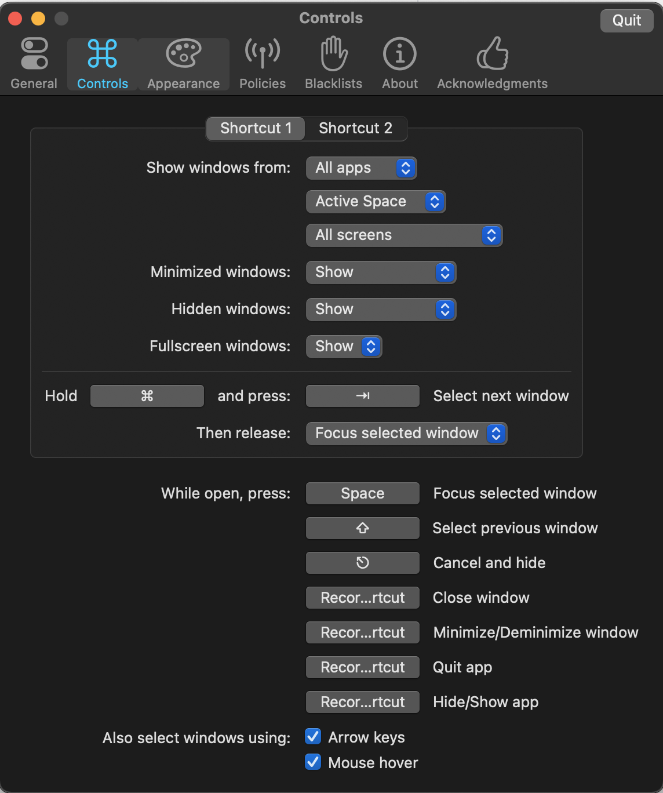
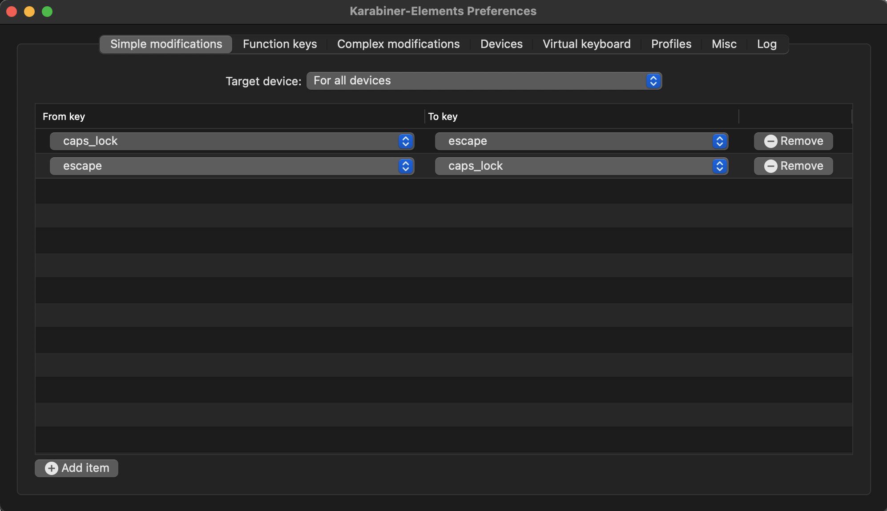
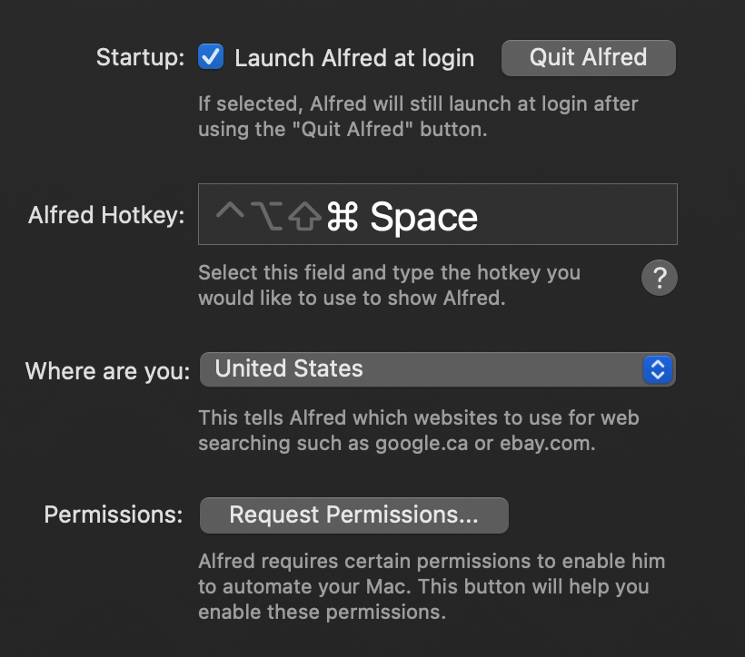
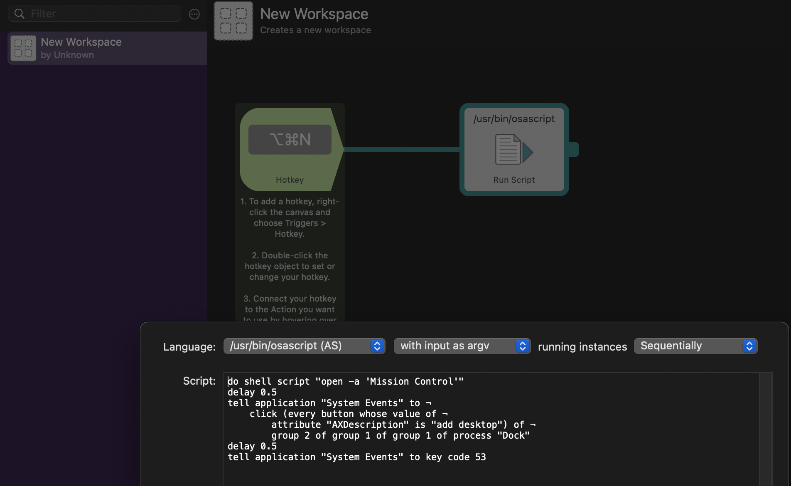
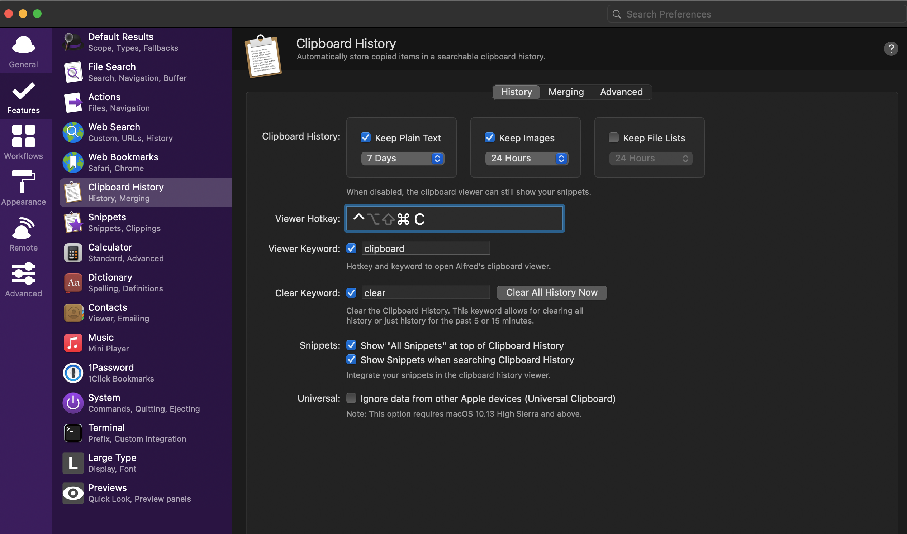

# Dotfiles / Configurations for MacOS 11.1 (Big Sur)

Follow the below instructions to configure your working environment

### System Configurations

1. Uninstall all relevant programs by going to `Launchpad > Applications > drag to trash`. Note that most built-in applications apparently cannot be uninstalled. The only applications which I was able to install include: GarageBand, Keynote, Numbers, Pages. The last three are the equivalent of MS PPT, Excel, and Word.

2. Install Google Chrome + Extensions
    - Vimium (un-exclude gmail)
    - Rearrange Tabs (go to chrome://extensions/shortcuts to configure if necessary)
    - Nordpass
    - AdBlock Pro
    - BlockSite
    - JSON Viewer
    - Remove shortcuts from new tab page (bottom right corner > Customize)
    - Update settings as appropriate
    - Set default page zoom to 110%

3. Install Spotify
    - If necessary, upload and download all local file music into individual folders under "Music", and configure Local Files settings to search the "Music" folder. Note that you may need to change the filenames of some of the songs (apostrophes are converted to underscores)

4. Install NordPass (desktop app)

5. Finder (`Finder > Preferences` in menu bar)
    <details>
        <summary>See more</summary>
        
    See the screenshots below:    
           

    </details>

6. System Preferences
    <details>
        <summary>See more</summary>

    - Apple ID: disable any apps using iCloud, except "iCloudDrive" and "Find My Mac"
    - General

        

    - Desktop & Screen Saver
        - Change desktop background (download from Drive)
        - Disable screensaver (start after: Never)
    - Dock & Menu Bar, Mission Control

         

    - Siri: disable completely
    - Language & Region

        

    - Notifications: disable completely
    - Bluetooth / Sound: connect Airpods + disable "Play sound on startup"
    - Keyboard
        - Keyboard, Text:

             

        - Shortcuts: disable everything except the following

               

    - Trackpad

          

    - Mouse

        

    - Display

         

    - Battery

         
    </details>

7. Install additional 3rd party programs:
    <details>
        <summary>See more</summary>

    - Smooze (mouse scrolling)
        - Install / purchase. I have a license which should be usable for one more computer.

        

    - BetterSnapTool (window management)
        - Download from the App Store. I purchased it several years ago.

            

    - Bartender4 (menu bar)
        - Currently using free trial; will cost $15 when out of free trial. May need to purchase and activate license at some point.
        - Apparently optimized for MacOS Big Sur

         

    - Alt-Tab (window navigation)
        - Currently configured to display all windows within active space.

          
        
    - Karabiner Elements
        - Remapped caps lock and escape.
        - TODO: If the Apple magic keyboard supports it, remap fn and ctrl

        

    - Alfred 4
        - Purchase power-pack (not sure if license can be shared across multiple computers).
        - Create hotkey keyboard shortcut (Alt-Cmd-N) to create a new workspace.
        - TODO: Figure out if there's a convenient way to export workflows across systems.
        - TODO: Create keyboard shortcut to move windows between workspaces

          

    </details>

8. Miscellaneous manual tasks:
    - Go to Stocks, and configure watchlist appropriately
    - TODO: Printers & Scanners
    - TODO: Speed up animations on MacOS

### Coding Environment

1. Install iTerm2
    - (Note: I would prefer to use Terminator, but as of now it is impossible to install Terminator on MacOS 11. Terminator must be installed using the Fink project, but Fink currently does not support MacOS 11)
    - Download and install directly from the [iTerm2 website](https://iterm2.com)

2. Set up dotfiles and config files

```
mkdir ~/projects; cd ~/projects
git clone https://github.com/xiebrian/dotfiles.git
cd dotfiles
git checkout macos

./scripts/install_1.sh

# You may need to go into iTerm preferences > General > Preferences and load from
# ~/projects/dotfiles/iterm
# Setup default iTerm2 window arrangement, following the directions here:
# https://apple.stackexchange.com/questions/98342/changing-the-default-size-of-iterm2-when-it-opens
```

3. Install Brew

```
./scripts/install_2.sh
```

4. Update Bash and set as default shell (see [here](https://itnext.io/upgrading-bash-on-macos-7138bd1066ba) for more info)

```
brew install bash
which -a bash
# You should see two shells:
# - default system bash (something like /bin/bash)
# - updated version (something like /opt/homebrew/bin/bash)
# Note the path to the updated version.

# "Whitelist" the newly installed bash shell
sudo vim /etc/shells
# Append the filepath to the end of the file

# Set Bash as the default shell
chsh -s /path/to/shell
```

5. Install additional packages

```
# Go: visit https://golang.org/doc/install, download, and follow the instructions
./scripts/install_3.sh
```
